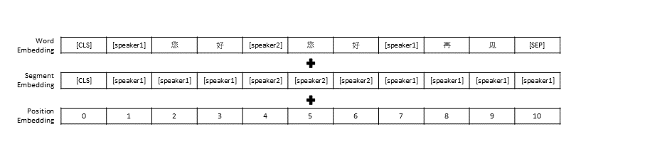

# CDial-GPT

* 本项目提供了一个大规模中文对话数据集，并提供了在此数据集上的中文对话预训练模型（中文GPT模型），更多信息可参考我们的[论文](https://arxiv.org/abs/2008.03946)。

* 本项目代码修改自[TransferTransfo](https://github.com/huggingface/transfer-learning-conv-ai)，使用了HuggingFace Pytorch版的[Transformers](https://github.com/huggingface/transformers)库, 可用于预训练与微调。

## 目录
* <a href="#Dataset-zh">数据集概况</a>
* <a href="#Pre-training-zh">预训练模型概况</a>
* <a href="#Evaluation-zh">评测结果</a>

## News
- 2021-01-09: 实验室出版新书[《现代自然语言生成》](https://github.com/thu-coai/NLG_book)，欢迎大家阅读购买。
- 2020-11-20: 实验室预训练模型新工作[SentiLARE](https://github.com/thu-coai/SentiLARE)。本工作将词级别的语言学知识（包括词性和词的情感极性）引入预训练语言模型中，提出了一种适用于情感分析任务的语言表示模型SentiLARE，欢迎大家使用。
- 2020-10-18: 我们的论文《A Large-Scale Chinese Short-Text Conversation Dataset》获得了NLPCC2020 Best Student Paper Award。 🎉 🎉 🎉 
- - 2020-09-08: 感谢[@xiejiachen](https://github.com/xiejiachen)所提供的[可视化Web界面](https://github.com/thu-coai/CDial-GPT/tree/master/contrib/dash_app)。
- 2020-09-02: 可用[bert4keras](https://github.com/bojone/bert4keras)加载[TF版本的CDial-GPT模型](https://github.com/bojone/CDial-GPT-tf)，感谢苏剑林[@bojone](https://github.com/bojone)提供代码。

## <a name="#Dataset-zh">数据集概况</a>
我们所提供的数据集LCCC(Large-scale Cleaned Chinese Conversation)主要包含两部分:
[LCCC-base](https://cloud.tsinghua.edu.cn/f/f131a4d259184566a29c/) 和
[LCCC-large](https://cloud.tsinghua.edu.cn/f/8424e7b9454c4e628c24/).
我们设计了一套严格的数据过滤流程来确保该数据集中对话数据的质量。
这一数据过滤流程中包括一系列手工规则以及若干基于机器学习算法所构建的分类器。
我们所过滤掉的噪声包括：脏字脏词、特殊字符、颜表情、语法不通的语句、上下文不相关的对话等。

该数据集的统计信息如下表所示。
其中，我们将仅包含两个语句的对话称为“单轮对话”，我们将包含两个以上语句的对话称为“多轮对话”。
统计词表大小时使用 [Jieba](https://github.com/fxsjy/jieba) 分词。

| [LCCC-base](https://cloud.tsinghua.edu.cn/f/f131a4d259184566a29c/) | 单轮对话 | 多轮对话  |
| :----------------------------------------------------------- | :--------- | :---------  |
| 总对话轮次                                                    |  3,354,382 |  3,466,607  |
| 总对话语句                                                    |  6,708,554 | 13,365,268  |
| 总字符数                                                      | 68,559,727 | 163,690,614 |
| 词表大小                                                      |   372,063  |   666,931   |
| 对话语句的评价词数                                             |    6.79    |    8.32     |
| 每轮对话的平均语句数                                           |      2     |    3.86     |

请注意， LCCC-base 数据集的清洗过程比 LCCC-large 更为严格，因此其规模也更小。

| [LCCC-large](https://cloud.tsinghua.edu.cn/f/8424e7b9454c4e628c24/) | 单轮对话 | 多轮对话  |
| :----------------------------------------------------------- | :---------  | :---------  |
| 总对话轮次                                                    |  7,273,804  |  4,733,955  |
| 总对话语句                                                    | 14,547,608  | 18,341,167  |
| 总字符数                                                      | 162,301,556 | 217,776,649 |
| 词表大小                                                      |   662,514   |   690,027   |
| 对话语句的评价词数                                             |    7.45     |    8.14     |
| 每轮对话的平均语句数                                           |      2      |    3.87     |

LCCC-base 数据集中的原始对话数据来自于微博对话，LCCC-large 数据集中的原始对话数据在这些微博对话的基础上融合了其他开源对话数据集：

| 数据集                              | 总对话轮次  | 对话示例                               |
| :---------------------------------- | :-------: | :---------------------------------- |
| Weibo Corpus                      | 79M | Q:火锅我在重庆成都吃了七八顿火锅 A: 哈哈哈哈！那我的嘴巴 可能要烂掉！ |
| [PTT Gossiping Corpus](https://github.com/zake7749/Gossiping-Chinese-Corpus) | 0.4M | Q:为什么乡民总是欺负国高中生呢QQ A:如果以为选好科系就会变成比尔盖兹那不如退学吧 |
| [Subtitle Corpus](https://github.com/skdjfla/dgk_lost_conv) | 2.74M | Q:京戏里头的人都是不自由的 A:他们让人拿笼子给套起来了了 |
| [Xiaohuangji Corpus](https://github.com/skdjfla/dgk_lost_conv) | 0.45M | Q:你谈过恋爱么 A:谈过，哎，别提了，伤心.. |
| [Tieba Corpus](https://github.com/codemayq/chinese_chatbot_corpus) | 2.32M | Q:前排，鲁迷们都起床了吧 A:标题说助攻，但是看了那球，真是活生生的讽刺了 |
| [Qingyun Corpus](https://github.com/codemayq/chinese_chatbot_corpus) | 0.1M | Q:看来你很爱钱 A:噢是吗？那么你也差不多了 |
| [Douban Conversation Corpus](https://github.com/MarkWuNLP/MultiTurnResponseSelection) | 0.5M | Q:看原版英文电影学纯正英语 A:大爱老友记反复看了好多次 了 Q:一样光盘都快被我看花了 A:那你现在的英语应该不错了 |
| [E-commerical Conversation Corpus](https://github.com/cooelf/DeepUtteranceAggregation) | 0.5M | Q:这个会不会聚划算 A:暂时没有哦 Q:后期会不会有 A:不一定哦亲多多关注我们哦 |
| [Chinese Chat Corpus](https://github.com/yangjianxin1/GPT2-chitchat) | 0.5M | Q: 我今天腿都废了，你们过节，我搬砖 A: 辛苦啊，圣诞节还去赚大钱了加油 Q: 毕竟是没男朋友的人，什么节都是一样的 |

## <a name="#Pre-training-en">预训练模型概况</a>
### 模型  
我们同时提供了一系列中文预训练模型（中文GPT模型），这些模型的预训练过程分为两步，首先在一个中文小说数据上预训练，然后在LCCC数据集上预训练。

我们沿用了 [TransferTransfo](https://arxiv.org/abs/1901.08149) 中的数据预处理设定，既将所有的对话历史拼接为一个句子，然后使用这个句子作为模型的输入，预测对话回复。我们模型的输入除了各个词的向量表示外，还包括发话人向量表示和位置向量表示。

| 预训练模型        | 参数数量 | 预训练所使用数据   | 描述                                       |
|---------------------| ------ |--------------------------|-------------------------------------------------- |
| GPTNovel                 | 95.5M | 中文小说数据| 基于中文小说数据所构建中文预训练GPT模型 （该小说数据中共包括1.3B个字）  |
| [CDial-GPTLCCC-base](https://huggingface.co/thu-coai/CDial-GPT_LCCC-base)   | 95.5M | LCCC-base  | 在GPTNovel的基础上，使用 LCCC-base 训练得到的中文预训练GPT模型   |
| [CDial-GPT2LCCC-base](https://huggingface.co/thu-coai/CDial-GPT2_LCCC-base) | 95.5M | LCCC-base  | 在GPTNovel的基础上，使用 LCCC-base 训练得到的中文预训练GPT2模型  |
| [CDial-GPTLCCC-large](https://huggingface.co/thu-coai/CDial-GPT_LCCC-large) | 95.5M | LCCC-large | 在GPTNovel的基础上，使用 LCCC-large 训练得到的中文预训练GPT模型  |

### 安装  
从源代码直接安装：

    git clone https://github.com/thu-coai/CDial-GPT.git
    cd CDial-GPT
    pip install -r requirements.txt 
    
### 快速开始
Step 1: 准备预训练模型和 fine-tuning 所需使用的数据集(如 [STC dataset](https://arxiv.org/abs/1503.02364) 或该项目目录中的toy数据 "data/toy_data.json", 请注意如数据中包含英文需按字母分割如：h e l l o)
    
    wget https://cloud.tsinghua.edu.cn/f/372be4a9994b4124810e/?dl=1 -O STC-corpus.zip  # 下载 STC 数据集并将其解压至 "data_path" 目录 (如果微调所使用的数据集为 STC)
    git lfs install
    git clone https://huggingface.co/thu-coai/CDial-GPT_LCCC-large  # 您可自行下载模型或者OpenAIGPTLMHeadModel.from_pretrained("thu-coai/CDial-GPT_LCCC-large")
  
Step 2: 训练模型

    python train.py --pretrained --model_checkpoint thu-coai/CDial-GPT_LCCC-large --data_path data/STC.json --scheduler linear  # 使用单个GPU进行训练

或者

    python -m torch.distributed.launch --nproc_per_node=8 train.py --pretrained --model_checkpoint thu-coai/CDial-GPT_LCCC-large --data_path data/STC.json --scheduler linear  # 以分布式的方式在8块GPU上训练

我们的训练脚本中还提供了 ``train_path`` 参数，用户可使用该参数以切片地形式读取纯文本文件。如果您所使用的的系统中内存有限，可以考虑使用该参数读入训练数据。
如果您使用 ``train_path`` 则需要将 ``data_path`` 置空。 

Step 3: 生成文本

    # YOUR_MODEL_PATH: 你要使用的模型的路径，每次微调后的模型目录保存在./runs/中
    python infer.py --model_checkpoint YOUR_MODEL_PATH --datapath data/STC_test.json --out_path STC_result.txt  # 在测试数据上生成回复
    python interact.py --model_checkpoint YOUR_MODEL_PATH  # 在命令行中与模型进行交互

训练脚本参数

| 参数  | 类型     | 默认值  | 描述 |
| :---- | :---------- | :----- | :------- |
| model_checkpoint | str | "" | Path or URL of model files (Directory of pre-training model and config/vocab files) |
| pretrained  | bool | False | If False, then train the model from scratch |
| data_path | str | "" | Path of the dataset |
| dataset_cache | str | default="dataset_cache" | Path or url of the dataset cache |
| train_path | str | "" | Path of the training set for distributed dataset |
| valid_path | str | "" | Path of the validation set for distributed dataset |
| log_file | str | "" | Output logs to a file under this path |
| num_workers | int | 1 | Number of subprocesses for data loading |
| n_epochs | int | 70 | Number of training epochs |
| train_batch_size | int | 8 | Batch size for training |
| valid_batch_size | int | 8 | Batch size for validation |
| max_history | int | 15 | Number of previous exchanges to keep in history |
| scheduler | str | "noam" | Method of optimizer |
| n_emd | int | 768 | Number of n_emd in config file (for noam) |
| eval_before_start | bool | False | If true, start evaluation before training |
| warmup_steps | int | 5000 | Warm up steps |
| valid_steps | int | 0 | Perform validation every X steps, if is not 0 |
| gradient_accumulation_steps | int | 64 | Accumulate gradients on several steps |
| max_norm | float | 1.0 | Clipping gradient norm |
| device | str | "cuda" if torch.cuda.is_available() else "cpu" | Device (cuda or cpu) |
| fp16 | str | "" | Set to O0, O1, O2 or O3 for fp16 training (see apex documentation) |
| local_rank | int | -1 | Local rank for distributed training (-1: not distributed) |

## <a name="#Evaluation-en">评测结果</a> 
我们评测了使用
[STC dataset](https://cloud.tsinghua.edu.cn/f/372be4a9994b4124810e/)
微调后的对话预训练模型。
所有的回复均使用 [Nucleus Sampling](https://arxiv.org/abs/1904.09751) 的方法采样得到 (p=0.9, temperature=0.7)。

#### 自动评价指标

| 模型  | 模型大小 | PPL  | BLEU-2 | BLEU-4 | Dist-1 | Dist-2 | Greedy Matching | Embedding Average |
| :------ | :------: | :------: | :------: | :------: | :------: | :------: | :------: | :------: |
| Attn-Seq2seq | 73M | 34.20 | 3.93 | 0.90 | 8.5 | 11.91 | 65.84 | 83.38 |
| Transformer | 113M | 22.10 | 6.72 | 3.14 | 8.8 | 13.97 | 66.06 | 83.55 |
| GPT2-chitchat | 88M | - | 2.28 | 0.54 | 10.3 | 16.25 | 61.54 | 78.94 |
| GPTNovel | 95.5M | 21.27 | 5.96 | 2.71 | 8.0 | 11.72 | 66.12 | 83.34 |
| GPTLCCC-base | 95.5M | 18.38 | 6.48 | 3.08 | 8.3 | 12.68 | 66.21 | 83.54 |
| GPT2LCCC-base | 95.5M | 22.76 | 5.69 | 2.50 | 7.7 | 10.87 | 66.24 | 83.46 |
| GPTLCCC-large | 95.5M | 18.23 | 6.63 | 3.20 | 8.3 | 12.71 | 66.25 | 83.63 |

#### 人工评价指标

我们为每个模型采样了200个回复，并在外包平台上邀请了3位标注员对这些回复进行人工评测，评测维度为对话流畅性、上下文相关性和回复多样性。每个维度的打分范围为 2/1/0。更多细节请参考我们的 [论文](https://arxiv.org/abs/2008.03946)。

| 模型  | +2      | +1      | +0      | Kappa   |
| :----- | :-----: | :-----: | :-----: | :-----: |
| Attn-Seq2Seq | 27.1% | 21.4% | 51.4% | 0.4544 |
| Transformer | 42.4% | 23.6% | 34.0% | 0.4429 |
| GPT2-chitchat | 24.3% | 19,1% | 56.6% | 0.3941 |
| GPTLCCC-base | 46.7% | 21.8% | 31.5% | 0.3954 |
| GPTLCCC-large | 48.6% | 24.5% | 27.0% | 0.4203 |

#### 不良回复统计

我们随机采样了1000个对话回复，并统计了这些回复中的不良回复：

| 包含重复语句 | 包含脏字 | 其他不良回复 |
| :----------: | :-----: | :-------: |
| 23 | 9 | 2 |

## GPTLCCC-large模型的生成示例

我们在STC数据集上微调了GPTLCCC-large模型的参数，并使用这一微调后的模型生成了如下对话示例：

| Post | Response |
| :----- | :---------- |
| 这 居 然 是 北 京 不 是 哈 尔 滨 。 | 哈 尔 滨 的 天 气 好 像 比 北 京 好 点 ， 我 这 里 就 是 小 雨 ， 白 天 都 是 大 风 |
| 运 营 商 校 园 广 告 大 P K ， 太 欢 乐 了 ！ 哈 哈 哈 。 | 我 以 为 是 马 云 的 广 告 。 |
| D e l s a S p o s a 糖 果 色 系 列 婚 纱 ， 粉 蓝 红 紫 ， 俏 皮 又 清 新 ， 你 喜 欢 吗 ？ | 最 后 一 件 太 美 了 ， 美 的 不 像 话 ！ |

我们还使用上述微调后的模型得到了如下交互结果：

| Roel | Response |
| :----- | :---------- |
| User | 别爱我没结果 |
| Bot | 没 结 果 的 爱 是 多 么 的 痛 。 |
| User | 但是爱过就可以了 |
| Bot | 有 时 候 ，爱 情 就 是 一 场 游 戏 。 |
| User | 输的总是我 |
| Bot | 我 爱 你 ， 就 像 我 爱 你 一 样 。 |
| User | 你可拉到吧 |
| Bot | 你 可 拉 到 吧 。 |
| User | 别学我说话 |
| Bot | 我 说 话 就 是 你 不 行 。 |
| User | 逼我动手是吧 |
| Bot | 不 ， 是 逼 你 动 口 是 吧 |
 
## 作者
[Yida Wang](https://github.com/lemon234071), [Pei Ke](https://github.com/kepei1106), [Yinhe Zheng](https://github.com/silverriver), [Kaili Huang](https://github.com/KellyHuang63), Yong Jiang, Xiaoyan Zhu, Minlie Huang

## 致谢
[Zuoxian Ye](https://github.com/yezuoxian), Yao Wang, Yifan Pan

## 免责声明
本项目所提供的 LCCC 数据集和预训练对话模型仅限科研用途。LCCC数据集中的对话收集自不同的来源，虽然我们设计了一套严格的数据清洗流程，但是我们并不保证所有不当内容均已被过滤。该数据中所包含的所有内容和意见与本项目作者无关。
本项目所提供的模型和代码仅为完整对话系统的一个组成部分，我们所提供的解码脚本仅限科研用途，使用本项目中的模型和脚本所生成的一切对话内容与本项目作者无关。

## 引用

如果您觉得我们的项目对您有帮助，请引用我们的[论文](https://arxiv.org/abs/2008.03946)：

    @inproceedings{wang2020chinese,
      title={A Large-Scale Chinese Short-Text Conversation Dataset},
      author={Wang, Yida and Ke, Pei and Zheng, Yinhe and Huang, Kaili and Jiang, Yong and Zhu, Xiaoyan and Huang, Minlie},
      booktitle={NLPCC},
      year={2020},
      url={https://arxiv.org/abs/2008.03946}
    }

---

# CDial-GPT

* This project provides a large-scale cleaned Chinese **conversation dataset** and a **Chinese GPT model** pre-trained on this dataset. Please refer to our [paper](https://arxiv.org/abs/2008.03946) for more details.

* Our code used for the pre-training is adapted from the [TransferTransfo](https://github.com/huggingface/transfer-learning-conv-ai) model based on the [Transformers](https://github.com/huggingface/transformers) library. The codes used for both pre-training and fine-tuning are provided in this repository.

## Contents
* <a href="#Dataset-en">Dataset</a>
* <a href="#Pre-training-en">Pre-training</a>
* <a href="#Evaluation-en">Evaluation</a>

## <a name="#Dataset-en">Dataset</a>
We present a Large-scale Cleaned Chinese Conversation corpus (LCCC) containing:
[LCCC-base](https://cloud.tsinghua.edu.cn/f/f131a4d259184566a29c/) and
[LCCC-large](https://cloud.tsinghua.edu.cn/f/8424e7b9454c4e628c24/).
A rigorous data cleaning pipeline is designed to ensure the quality of the corpus.
This pipeline involves a set of rules and several classifier-based filters.
Noises such as offensive or sensitive words, special symbols, emojis, grammatically incorrect sentences, and incoherent conversations are filtered.

The statistic of our corpus is presented below.
Dialogues with only two utterances are regarded as "Single-turn", and dialogues with more than three utterances are regarded as "Multi-turn".
The vocabulary size is calculated in word-level, and [Jieba](https://github.com/fxsjy/jieba) is used to tokenize each utterance to words.

| [LCCC-base](https://cloud.tsinghua.edu.cn/f/f131a4d259184566a29c/) | Single-turn | Multi-turn  |
| :----------------------------------------------------------- | :--------- | :---------  |
| Sessions                                                     |  3,354,382 |  3,466,607  |
| Utterances                                                   |  6,708,554 | 13,365,268  |
| Characters                                                   | 68,559,727 | 163,690,614 |
| Vocabulary                                                   |   372,063  |   666,931   |
| Avg. words per utterance                                     |    6.79    |    8.32     |
| Avg. utterances per session                                  |      2     |    3.86     |

Note that LCCC-base is cleaned using more strict rules compared to LCCC-large. 

| [LCCC-large](https://cloud.tsinghua.edu.cn/f/8424e7b9454c4e628c24/) | Single-turn | Multi-turn  |
| :----------------------------------------------------------- | :---------  | :---------  |
| Sessions                                                     |  7,273,804  |  4,733,955  |
| Utterances                                                   | 14,547,608  | 18,341,167  |
| Characters                                                   | 162,301,556 | 217,776,649 |
| Vocabulary                                                   |   662,514   |   690,027   |
| Avg. words per utterance                                     |    7.45     |    8.14     |
| Avg. utterances per session                                  |      2      |    3.87     |

The raw dialogues for LCCC-base originate from a Weibo Corpus that we crawled from [Weibo](www.weibo.com), and the raw dialogues for LCCC-large is built by combining several conversation datasets in addition to the Weibo Corpus:

| Dataset                              | Sessions  | Sample                               |
| :---------------------------------- | :-------: | :---------------------------------- |
| Weibo Corpus                      | 79M | Q:火锅我在重庆成都吃了七八顿火锅 A: 哈哈哈哈！那我的嘴巴 可能要烂掉！ |
| [PTT Gossiping Corpus](https://github.com/zake7749/Gossiping-Chinese-Corpus) | 0.4M | Q:为什么乡民总是欺负国高中生呢QQ A:如果以为选好科系就会变成比尔盖兹那不如退学吧 |
| [Subtitle Corpus](https://github.com/skdjfla/dgk_lost_conv) | 2.74M | Q:京戏里头的人都是不自由的 A:他们让人拿笼子给套起来了了 |
| [Xiaohuangji Corpus](https://github.com/skdjfla/dgk_lost_conv) | 0.45M | Q:你谈过恋爱么 A:谈过，哎，别提了，伤心.. |
| [Tieba Corpus](https://github.com/codemayq/chinese_chatbot_corpus) | 2.32M | Q:前排，鲁迷们都起床了吧 A:标题说助攻，但是看了那球，真是活生生的讽刺了 |
| [Qingyun Corpus](https://github.com/codemayq/chinese_chatbot_corpus) | 0.1M | Q:看来你很爱钱 A:噢是吗？那么你也差不多了 |
| [Douban Conversation Corpus](https://github.com/MarkWuNLP/MultiTurnResponseSelection) | 0.5M | Q:看原版英文电影学纯正英语 A:大爱老友记反复看了好多次 了 Q:一样光盘都快被我看花了 A:那你现在的英语应该不错了 |
| [E-commerical Conversation Corpus](https://github.com/cooelf/DeepUtteranceAggregation) | 0.5M | Q:这个会不会聚划算 A:暂时没有哦 Q:后期会不会有 A:不一定哦亲多多关注我们哦 |
| [Chinese Chat Corpus](https://github.com/yangjianxin1/GPT2-chitchat) | 0.5M | Q: 我今天腿都废了，你们过节，我搬砖 A: 辛苦啊，圣诞节还去赚大钱了加油 Q: 毕竟是没男朋友的人，什么节都是一样的 |

## <a name="#Pre-training-en">Pre-training</a>
### Models  
We also present a series of Chinese GPT model that are first pre-trained on a Chinese novel dataset and then post-trained on our LCCC dataset.

Similar to [TransferTransfo](https://arxiv.org/abs/1901.08149), we concatenate all dialogue histories into one context sentence, and use this sentence to predict the response. The input of our model consists of word embedding, speaker embedding, and positional embedding of each word.

| Models        | Parameter Size | Pre-training Dataset   | Description                                       |
|---------------------| ------ |--------------------------|-------------------------------------------------- |
| GPTNovel | 95.5M | Chinese Novel            | A GPT model pre-trained on Chinese Novel dataset (1.3B words, note that we do not provide the detail of this model)  |
| [CDial-GPTLCCC-base](https://huggingface.co/thu-coai/CDial-GPT_LCCC-base)  | 95.5M | [LCCC-base](##datasets)  | A GPT model post-trained on LCCC-base dataset from GPTNovel |
| [CDial-GPT2LCCC-base](https://huggingface.co/thu-coai/CDial-GPT2_LCCC-base) | 95.5M | [LCCC-base](##datasets)  | A GPT2 model post-trained on LCCC-base dataset from GPTNovel |
| [CDial-GPTLCCC-large](https://huggingface.co/thu-coai/CDial-GPT_LCCC-large) | 95.5M | [LCCC-large](##datasets) | A GPT model post-trained on LCCC-large dataset from GPTNovel |

### Installation  
Install from the source codes:

    git clone https://github.com/thu-coai/CDial-GPT.git
    cd CDial-GPT
    pip install -r requirements.txt 
    
### Quick Start
Step 1: Prepare the data for fine-tuning (E.g., [STC dataset](https://arxiv.org/abs/1503.02364) or "data/toy_data.json" in our respository) and the pre-trianed model:
    
    wget https://cloud.tsinghua.edu.cn/f/372be4a9994b4124810e/?dl=1 -O STC-corpus.zip  # Download the STC dataset and unzip into "data_path" dir (fine-tuning on STC)
    git lfs install
    git clone https://huggingface.co/thu-coai/CDial-GPT_LCCC-large  # or OpenAIGPTLMHeadModel.from_pretrained("thu-coai/CDial-GPT_LCCC-large")
  
Step 2: Train the model

    python train.py --pretrained --model_checkpoint thu-coai/CDial-GPT_LCCC-large --data_path data/STC.json --scheduler linear  # Single GPU training

or

    python -m torch.distributed.launch --nproc_per_node=8 train.py --pretrained --model_checkpoint thu-coai/CDial-GPT_LCCC-large --data_path data/STC.json --scheduler linear  # Training on 8 GPUs

Note: We have also provided ``train_path`` argument in the training script to read dataset in plain text, which will be sliced and handled distributionally.
You can consider to use this argument if the dataset is too large for your system's memory. (also, remember to leave the ``data_path`` argument empty if you are using ``train_path``). 

Step 3: Inference mode

    # YOUR_MODEL_PATH: the model path used for generation
    python infer.py --model_checkpoint YOUR_MODEL_PATH --datapath data/STC_test.json --out_path STC_result.txt  # Do Inference on a corpus
    python interact.py --model_checkpoint YOUR_MODEL_PATH  # Interact on the terminal

Training Arguments

| Arguments  | Type     | Default value  | Description |
| :---- | :---------- | :----- | :------- |
| model_checkpoint | str | "" | Path or URL of model files (Directory of pre-training model and config/vocab files) |
| pretrained  | bool | False | If False, then train the model from scratch |
| data_path | str | "" | Path of the dataset |
| dataset_cache | str | default="dataset_cache" | Path or url of the dataset cache |
| train_path | str | "" | Path of the training set for distributed dataset |
| valid_path | str | "" | Path of the validation set for distributed dataset |
| log_file | str | "" | Output logs to a file under this path |
| num_workers | int | 1 | Number of subprocesses for data loading |
| n_epochs | int | 70 | Number of training epochs |
| train_batch_size | int | 8 | Batch size for training |
| valid_batch_size | int | 8 | Batch size for validation |
| max_history | int | 15 | Number of previous exchanges to keep in history |
| scheduler | str | "noam" | Method of optimizer |
| n_emd | int | 768 | Number of n_emd in config file (for noam) |
| eval_before_start | bool | False | If true, start evaluation before training |
| warmup_steps | int | 5000 | Warm up steps |
| valid_steps | int | 0 | Perform validation every X steps, if is not 0 |
| gradient_accumulation_steps | int | 64 | Accumulate gradients on several steps |
| max_norm | float | 1.0 | Clipping gradient norm |
| device | str | "cuda" if torch.cuda.is_available() else "cpu" | Device (cuda or cpu) |
| fp16 | str | "" | Set to O0, O1, O2 or O3 for fp16 training (see apex documentation) |
| local_rank | int | -1 | Local rank for distributed training (-1: not distributed) |

## <a name="#Evaluation-en">Evaluation</a> 
Evaluation is performed on results generated by models fine-tuned on
[STC dataset](https://cloud.tsinghua.edu.cn/f/372be4a9994b4124810e/).
All responses are generated using the [Nucleus Sampling](https://arxiv.org/abs/1904.09751) scheme with a threshold 0.9 and temperature 0.7.

#### Automatic Evaluation

| Models  | Model Size | PPL  | BLEU-2 | BLEU-4 | Dist-1 | Dist-2 | Greedy Matching | Embedding Average |
| :------ | :------: | :------: | :------: | :------: | :------: | :------: | :------: | :------: |
| Attn-Seq2seq | 73M | 34.20 | 3.93 | 0.90 | 8.5 | 11.91 | 65.84 | 83.38 |
| Transformer | 113M | 22.10 | 6.72 | 3.14 | 8.8 | 13.97 | 66.06 | 83.55 |
| GPT2-chitchat | 88M | - | 2.28 | 0.54 | 10.3 | 16.25 | 61.54 | 78.94 |
| GPTNovel | 95.5M | 21.27 | 5.96 | 2.71 | 8.0 | 11.72 | 66.12 | 83.34 |
| GPTLCCC-base | 95.5M | 18.38 | 6.48 | 3.08 | 8.3 | 12.68 | 66.21 | 83.54 |
| GPT2LCCC-base | 95.5M | 22.76 | 5.69 | 2.50 | 7.7 | 10.87 | 66.24 | 83.46 |
| GPTLCCC-large | 95.5M | 18.23 | 6.63 | 3.20 | 8.3 | 12.71 | 66.25 | 83.63 |

#### Human Evaluation

We also employed 3 crowd-sourced annotators to evaluate 200 samples of each model about fluency, relevance, and diversity based on a 2/1/0 score schema. Refer to our [paper](https://arxiv.org/abs/2008.03946) for more details.

| Models  | +2      | +1      | +0      | Kappa   |
| :----- | :-----: | :-----: | :-----: | :-----: |
| Attn-Seq2Seq | 27.1% | 21.4% | 51.4% | 0.4544 |
| Transformer | 42.4% | 23.6% | 34.0% | 0.4429 |
| GPT2-chitchat | 24.3% | 19,1% | 56.6% | 0.3941 |
| GPTLCCC-base | 46.7% | 21.8% | 31.5% | 0.3954 |
| GPTLCCC-large | 48.6% | 24.5% | 27.0% | 0.4203 |

#### Toxic Generation Statistics

We randomly select 1000 generated samples, and make a statistic of toxic generation:

| Repetition | Dirty word | Other Bad Cases |
| :----------: | :-----: | :-------: |
| 23 | 9 | 2 |

## Case study of GPTLCCC-large
Single-turn generated examples from STC dataset (fine-tuned on STC):

| Post | Response |
| :----- | :---------- |
| 这 居 然 是 北 京 不 是 哈 尔 滨 。 | 哈 尔 滨 的 天 气 好 像 比 北 京 好 点 ， 我 这 里 就 是 小 雨 ， 白 天 都 是 大 风 |
| 运 营 商 校 园 广 告 大 P K ， 太 欢 乐 了 ！ 哈 哈 哈 。 | 我 以 为 是 马 云 的 广 告 。 |
| D e l s a S p o s a 糖 果 色 系 列 婚 纱 ， 粉 蓝 红 紫 ， 俏 皮 又 清 新 ， 你 喜 欢 吗 ？ | 最 后 一 件 太 美 了 ， 美 的 不 像 话 ！ |

Multi-turn generated examples using the interactive script:

| Roel | Response |
| :----- | :---------- |
| User | 别爱我没结果 |
| Bot | 没 结 果 的 爱 是 多 么 的 痛 。 |
| User | 但是爱过就可以了 |
| Bot | 有 时 候 ，爱 情 就 是 一 场 游 戏 。 |
| User | 输的总是我 |
| Bot | 我 爱 你 ， 就 像 我 爱 你 一 样 。 |
| User | 你可拉到吧 |
| Bot | 你 可 拉 到 吧 。 |
| User | 别学我说话 |
| Bot | 我 说 话 就 是 你 不 行 。 |
| User | 逼我动手是吧 |
| Bot | 不 ， 是 逼 你 动 口 是 吧 |
 
[//]: #  (Multi-turn self-playing dialogue with user prompt:)

[//]: #  (Commonsense question answering examples:)

## Authors
[Yida Wang](https://github.com/lemon234071), [Pei Ke](https://github.com/kepei1106), [Yinhe Zheng](https://github.com/silverriver), [Kaili Huang](https://github.com/KellyHuang63), Yong Jiang, Xiaoyan Zhu, Minlie Huang

## Acknowledgement
[Zuoxian Ye](https://github.com/yezuoxian), Yao Wang, Yifan Pan

## Disclaimer
The LCCC dataset and the pre-trained models aim to facilitate the research for conversation generation. The LCCC dataset provided in this repository originates from various sources. Although a rigorous cleaning process has been carried out, there is no guarantee that all the inappropriate contents have been completely filtered out. All the contents contained in this dataset does not represent the authors' opinion.
This repository contains only part of the modeling machinery needed to actually produce a dialogue model. The decoding script provided in this repository is only for the research purpose. We are not responsible for any contents generated using our model.

## Citation
Please kindly cite our [paper](https://arxiv.org/abs/2008.03946) if you use the datasets or models in your research:

    @inproceedings{wang2020chinese,
      title={A Large-Scale Chinese Short-Text Conversation Dataset},
      author={Wang, Yida and Ke, Pei and Zheng, Yinhe and Huang, Kaili and Jiang, Yong and Zhu, Xiaoyan and Huang, Minlie},
      booktitle={NLPCC},
      year={2020},
      url={https://arxiv.org/abs/2008.03946}
    }
