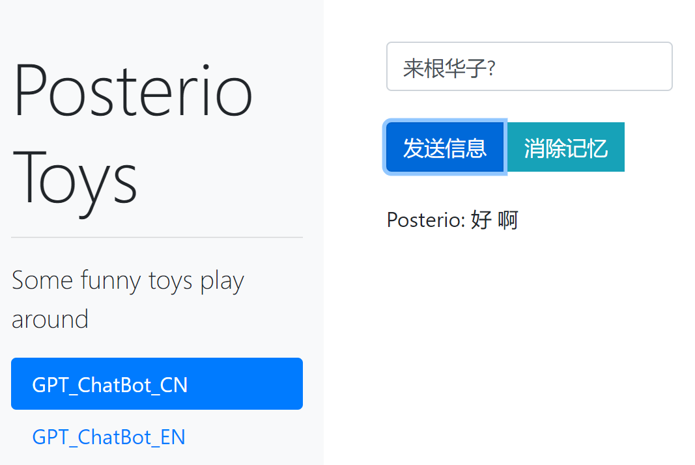
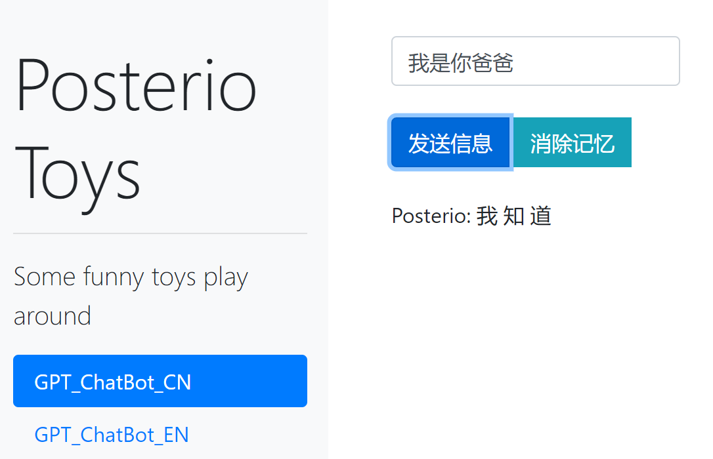
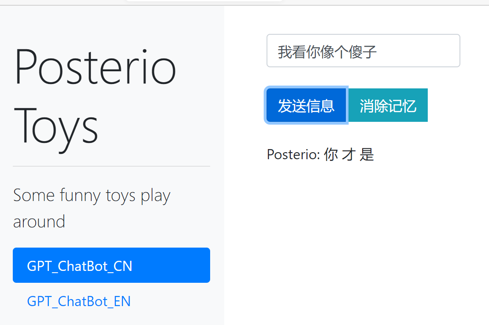

# Dash application

#### Quick start

`pip install dash==1.15.0`

`pip install dash-bootstrap-components `

`python app.py --model_checkpoint [model_path}`

Model_Path: the model checkpoint savepath, e.g. `./models/`

